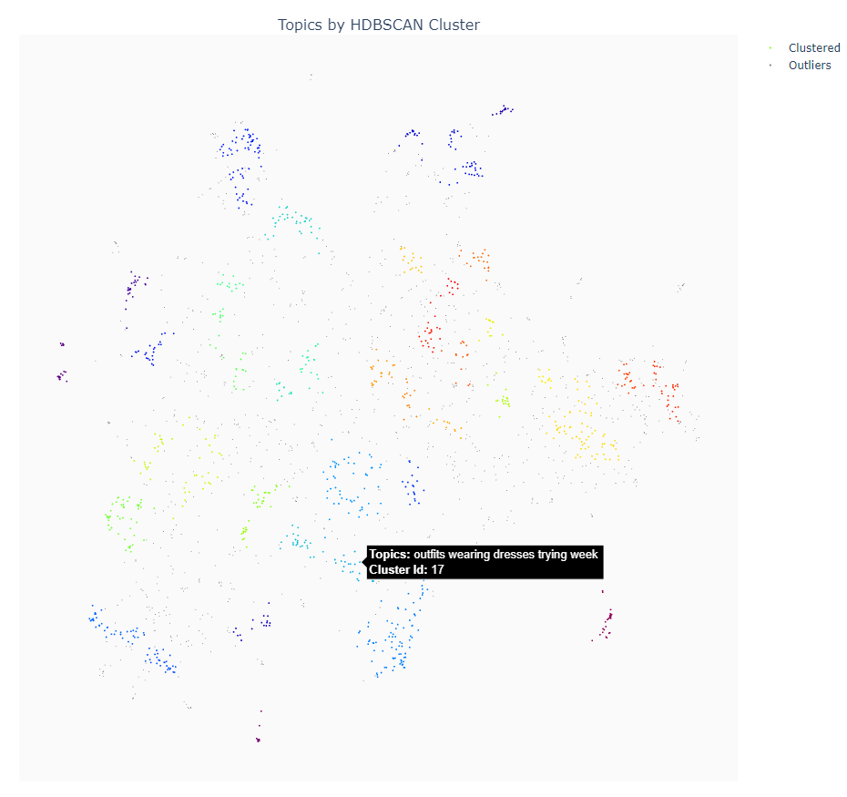
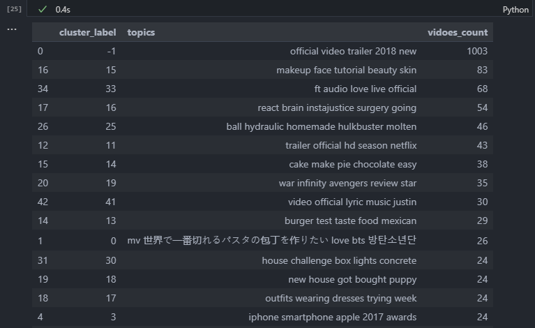

# Lab 3 - NLP Topic Modeling (Part 1?)

## Warning

Some of you might have felt like we have been throwing you to the sharks in the previous labs. Anyways...

~~Get ready for sharknado!!!~~

**This lab might seem very hard / very complex.**

That's okay, you are not expected to understand all of it, only follow the instructions given in the notebook, to give you perspective on how to use the tools you have learned in the previous labs, plus learn about a potential NLP use case.

**Please do not expect understanding, but rather try to look at this lab as an exploration of what a NLP use case might look like.**

If you want to understand everything, then you are free to spend your free time with inspecting / testing and playing around with all the code and learn from it, but there is no way we could teach you a thurough understand of the concepts used in this lab in the four hours that you have to work on it. Remember that this is an introductory course.

To give some perspective on how impossible it would be to give you a full understanding, It took me maybe 10 - 15 hours to learn what I needed to do plotly the way it is done in this lab, maybe 10 - 15 hours to understand how the sentence transformer really worked, and what functions to use and how to use them, then 10ish ours of playing with UMAP, 5 - 10 hours of looking at clustering algorithms, and 5ish hours to understand how tf-idf worked and how it was used to find topics. And that was after having taken this course fully, learning these things in a context where I was surrounded by mentors and people who knew way more than me. These time estimates are also not counting the time needed to figure out that these where the things to use and learn among all the other thing I tried to shape my understanding. Consider this a curation of things that might be cool know about, not a list of things you need to understand.

**Please understand that we are not giving you these labs for you to learn and understand everything, but more as a way to show you how things can be done.**
A complete understanding of ML is not in the scope of this course, so it will not be provied, but you are free to learn more about it on your own time. and use this notebook as a guide on what to learn, or at least what direction to go in when learning.

Please also understand that the things we show is more a simplified version of a real ML pipeline that takes in real data and provides real valuable predictions and results. It's just hard to make it much simpler without making it unclear what you are doing or what results can be provided by the tools you are using.

You are not supposed to understand everything in depth, only learn about how to use the tools and have a somewhat feasible idea on to apply them to a real world problem, or at least have an idea on where to start

## New Imports

<!-- 
TO BE DELETED
Run the commands in [new_channels.txt](new_channels.txt) to add new installation channels to your conda environment.

Check the [requirements_mac.txt](requirements_mac.txt) file or the [requirements_windows.txt](requirements_windows.txt) to see what new packages you need to install, and which commands to use to install them
 -->

Here are the commands needed to install the new packages:

```bash
# Windows specific command
conda install pytorch cudatoolkit=11.6 -c pytorch -c conda-forge

# Mac specific command
conda install pytorch -c pytorch

# These three commands are for both mac and windows, feel free to try to oneline it for a bit of a conda chalange
conda install -c conda-forge -c plotly sentence-transformers umap-learn hdbscan plotly
conda install -c conda-forge nbformat
conda install -c conda-forge python-kaleido 
```


## Steps to Finish Notebook
TBA


## Finished Notebook Screenshot

You should have a topic plot like this:



And a topic listing per cluster like this:

